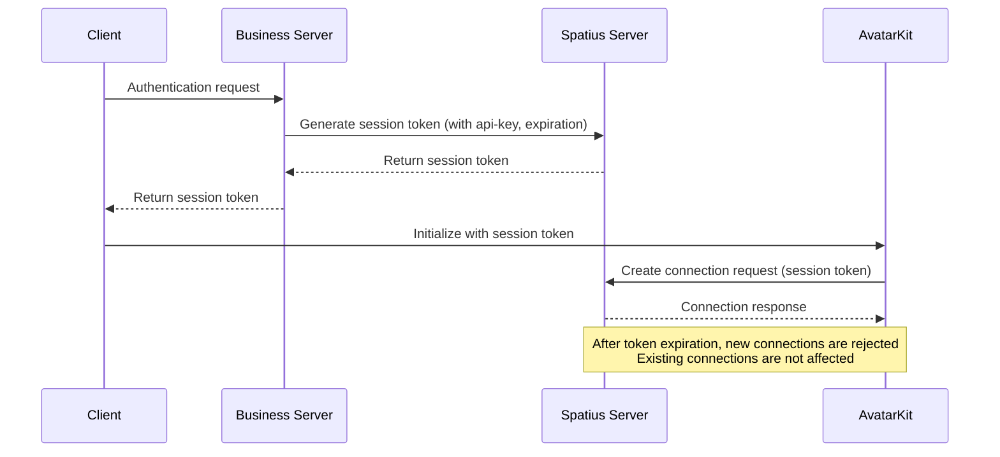

## Before you start

Before you begin, make sure you have your app-id and api-key.
AvatarKit authentication requires a server-side component, so you need to implement an authentication endpoint on your own server.

## Connection flow

1. The client sends an authentication request to your business server.
2. The business server sends a request to Spatius's server to generate a session token, including information such as expiration time in the request body, and providing the api-key.
3. The Spatius server returns the session token to your business server.
4. The business server returns the session token to the client.
5. The client initializes AvatarKit with the session token.
6. Inside AvatarKit, a connection request is created to the Spatius server using the session token.

## Token expiration

If you attempt to establish a new connection after the token's configured expiration time, it will be rejected.
Existing established connections are not affected.

## Notes

- Avoid leaking your api-key; ensure it is only used on the server.
- The session token is designed to be single-use. Ensure a new token is used for each connection.

> For detailed authentication API docs, see the [API Reference](/api-reference/api-reference)
