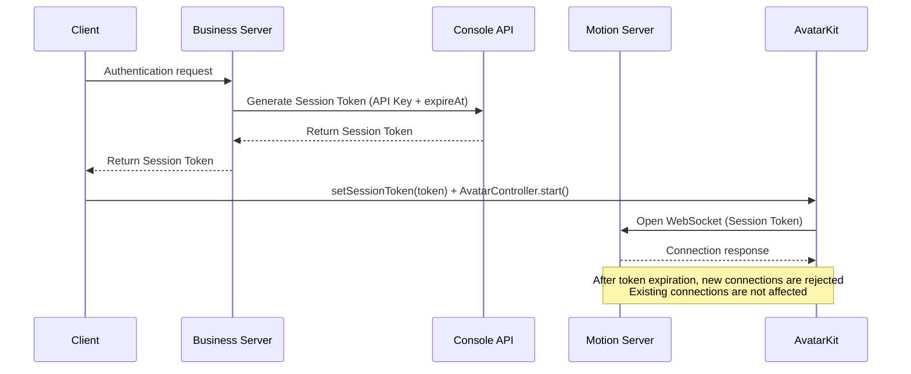

<Note>
**This flow only applies to Direct Mode** (`DrivingServiceMode.sdk`), where the client opens a Motion Server WebSocket from `AvatarController.start()`. Platform Integrations, Backend Mode, and the RTC Adapter path all use `DrivingServiceMode.host` — the client never opens that WebSocket and never needs a Spatius Session Token. Those paths authenticate inside their own transport (LiveKit room token, Agora RTC token, your backend's own auth, etc.). See [Credentials](/getting-started/credentials).
</Note>

## Before you start

Make sure you have your App ID and API Key. Session Token issuance requires a server-side component — implement an authentication endpoint on your own business server.

The flow involves two distinct Spatius services:

- **Console API** — issues Session Tokens. Your business server calls this with your API Key.
- **Motion Server** — handles avatar runtime connections. The Direct Mode AvatarKit client connects here using the Session Token.

## Connection flow

1. The client sends an authentication request to your business server.
2. The business server sends a request to the **Spatius Console API** to generate a Session Token, including expiration time in the request body and the API Key in the `X-Api-Key` header.
3. The Console API returns the Session Token to your business server.
4. The business server returns the Session Token to the client.
5. The client calls `AvatarSDK.setSessionToken(token)` before `AvatarController.start()`. (The token is set on the SDK; it is **not** an `AvatarSDK.initialize()` parameter.)
6. `AvatarController.start()` opens the **Motion Server** WebSocket authenticated with the Session Token.

```mermaid
sequenceDiagram
    participant Client
    participant BizServer as Business Server
    participant Console as Console API
    participant Motion as Motion Server
    participant Kit as AvatarKit

    Client->>BizServer: Authentication request
    BizServer->>Console: Generate Session Token (API Key + expireAt)
    Console-->>BizServer: Return Session Token
    BizServer-->>Client: Return Session Token
    Client->>Kit: setSessionToken(token) + AvatarController.start()
    Kit->>Motion: Open WebSocket (Session Token)
    Motion-->>Kit: Connection response
    Note over Motion,Kit: After token expiration, new connections are rejected<br>Existing connections are not affected
```

## Token expiration

If you attempt to establish a new connection after the token's configured expiration time, it will be rejected. Existing established connections are not affected.

## Notes

- Avoid leaking your API Key; ensure it is only used on the server.
- The Session Token is designed to be single-use. Issue a fresh token for each connection.

> For detailed authentication API docs, see the [API Reference](/api-reference/api-reference).
