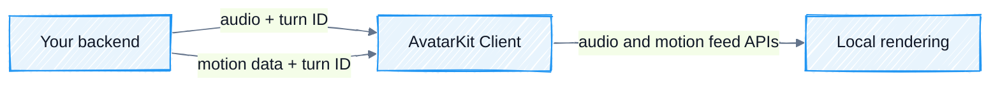

The client receives each response turn from your backend and renders it locally with AvatarKit. It never connects to Motion Server or holds a Spatius API Key.

<div style={{ backgroundColor: '#ffffff', border: '1px solid #e5e7eb', borderRadius: 12, padding: 12 }}>



</div>

## Implement the client

<Steps>
<Step title="Initialize AvatarKit in Backend Mode">

Use the same App ID, Avatar ID, region, and audio format as the backend session. Backend Mode does not use a Spatius Session Token on the client.

</Step>

<Step title="Connect to your backend">

Use your application's WebSocket or streaming transport. For every response, deliver the audio before its first motion data payload, and include the same turn ID on both message types.

</Step>

<Step title="Feed audio and motion data">

Pass each audio payload to the platform's audio-yield method. Store the conversation ID it returns against your backend turn ID, then use that conversation ID when you pass the matching motion data to AvatarKit.

<Accordion title="Web example">

```typescript
import {
  AvatarManager,
  AvatarSDK,
  AvatarView,
  DrivingServiceMode,
} from '@spatius/avatarkit'

await AvatarSDK.initialize('your-app-id', {
  drivingServiceMode: DrivingServiceMode.backend,
  audioFormat: { channelCount: 1, sampleRate: 16000 },
})

const avatar = await AvatarManager.shared.load('your-avatar-id')
const avatarView = new AvatarView(
  avatar,
  document.getElementById('avatar-container')!,
)
const controller = avatarView.controller
const conversationIds = new Map<string, string>()

const decodeBase64 = (value: string) =>
  Uint8Array.from(atob(value), (character) => character.charCodeAt(0))

document.getElementById('connect-button')!.addEventListener('click', async () => {
  // Browsers require audio initialization inside a user gesture.
  await controller.initializeAudioContext()

  const socket = new WebSocket('wss://your-backend.example/avatar')
  socket.addEventListener('message', (event) => {
    const message = JSON.parse(event.data)

    if (message.type === 'audio') {
      const id = controller.yieldAudioData(
        decodeBase64(message.payload),
        message.end,
      )
      if (id && !conversationIds.has(message.turnId)) {
        conversationIds.set(message.turnId, id)
      }
    }

    if (message.type === 'motion') {
      const id = conversationIds.get(message.turnId)
      if (id) {
        controller.yieldFramesData(
          message.payloads.map(decodeBase64),
          id,
        )
      }
      if (message.end) conversationIds.delete(message.turnId)
    }

    if (message.type === 'interrupt') {
      controller.interrupt()
      conversationIds.clear()
    }
  })
})
```

</Accordion>

</Step>

<Step title="Clean up">

Interrupt discarded turns, close your application transport, and dispose of the Avatar view when the experience ends. Do not call the Direct Mode `start()` or `send()` methods on this path.

</Step>
</Steps>

Exact Backend Mode method names are in the [Web](/sdk-reference/web-sdk/reference), [iOS](/sdk-reference/ios-sdk/api-reference), [Android](/sdk-reference/android-sdk/api-reference), and [Flutter](/sdk-reference/flutter-sdk/api-reference) references.

## Next steps

<CardGroup cols={2}>
  <Card title="Complete Backend Mode demo" icon="github" href="https://github.com/spatius-ai/spatius-integration-demo/tree/main/backend-mode" />
  <Card title="Client SDK references" icon="code" href="/reference/overview" />
</CardGroup>
