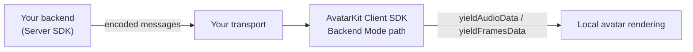

The Client SDK side of Backend Mode Integration renders encoded messages from your backend. The client does **not** connect directly to Motion Server. Instead, it receives audio and motion messages over your chosen transport and feeds them into AvatarKit.

## Responsibilities

| Client SDK responsibility | Description |
| --- | --- |
| **Initialize AvatarKit** | Configure the client with App ID, avatar, region, and the Backend Mode client setting for your SDK. |
| **Connect to your backend** | Join your WebSocket, RTC room, or other downstream transport. |
| **Consume encoded messages** | Receive audio and motion messages generated by the Server SDK. |
| **Render locally** | Feed messages into AvatarKit with `yieldAudioData()` and `yieldFramesData()`. |

<Warning>
Do not call `start()` and `send()` for the Backend Mode client path. Those are Direct Mode methods. Backend Mode clients receive messages from your backend and call the `yield*` methods.
</Warning>

## Next steps

<CardGroup cols={2}>
  <Card title="Web SDK reference" icon="globe" href="/sdk-reference/web-sdk/reference">
    Backend Mode client methods such as `yieldAudioData()` and `yieldFramesData()`.
  </Card>
  <Card title="iOS SDK reference" icon="apple" href="/sdk-reference/ios-sdk/api-reference">
    iOS AvatarKit API reference.
  </Card>
  <Card title="Android SDK reference" icon="android" href="/sdk-reference/android-sdk/api-reference">
    Android AvatarKit API reference.
  </Card>
  <Card title="Flutter SDK reference" icon="mobile" href="/sdk-reference/flutter-sdk/api-reference">
    Flutter Backend Mode input and rendering API.
  </Card>
</CardGroup>

<CardGroup cols={1}>
  <Card title="Browse all demos" icon="github" href="/resources/demo-projects">
    Every runnable demo by platform and integration path.
  </Card>
</CardGroup>
