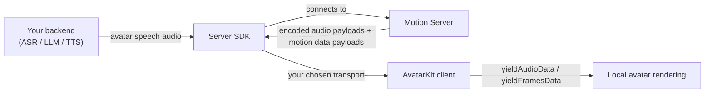

import { HostedModeRealtimeTransportDiagram, HostedModeOwnTransportDiagram } from '/snippets/spatius-diagrams.jsx'

## What is Backend Mode Integration?

Backend Mode Integration is a **Standalone Integration** centered on the **Server SDK**: your backend connects to Motion Server, sends avatar speech audio, receives encoded audio payloads and motion data payloads, then delivers those payloads to AvatarKit clients.

Use this path when your backend owns ASR, LLM, TTS, turn-taking, provider keys, and the connection to Motion Server.

## At a glance

| Dimension | Backend Mode Integration |
| --- | --- |
| **Dev effort** | 🔴 High |
| **Latency profile** | ⚙️ Low and tunable; your backend controls chunking, buffering, and downstream delivery. |
| **You build** | 🖥️ Server SDK session, 🎙️ audio pipeline, 🔀 transport, 🧩 client message feed, recovery, and observability. |
| **You do not build** | 🚫 Avatar rendering or motion generation. AvatarKit renders locally; Motion Server generates motion data. |
| **Best first demo** | 🧪 [Backend Mode demos](/resources/demo-projects#recommended-starting-points) after you understand the Server SDK role. |
| **Client support** | 🌐 Web / 🍎 iOS / 🤖 Android / 📱 Flutter |

## Core backend flow

The Server SDK is the required piece in this path. The client does not connect to Motion Server directly, and it usually does not hold a Spatius Session Token. Instead, the client receives encoded audio payloads and motion data payloads from your backend and feeds them into AvatarKit with `yieldAudioData()` and `yieldFramesData()`.

<Note>
Do not confuse a Backend Mode server with a Direct Mode token endpoint. A Direct Mode token endpoint only mints short-lived Session Tokens. A Backend Mode server is part of the runtime: it owns the audio pipeline, connects to Motion Server with the Server SDK, and transports encoded audio payloads + motion data payloads to clients.
</Note>

## SDK roles

| SDK surface | Runs in | What it does |
| --- | --- | --- |
| **[Server SDK](/backend-mode/server-sdk)** | Your backend | Authenticates with Spatius, connects to Motion Server, sends avatar speech audio, and receives encoded audio payloads and motion data payloads. |
| **[Client SDK](/backend-mode/client-sdk)** | Web, iOS, Android, or Flutter client | Receives encoded audio payloads and motion data payloads from your backend and renders them locally. |

## Requirements

| Requirement | Why it matters |
| --- | --- |
| **Server SDK** | Required. Your backend uses it to authenticate, connect to Motion Server, and provide encoded audio payloads and motion data payloads for clients. |
| **API Key** | Stored only on your backend. Used by the Server SDK, never by client apps. |
| **App ID and Avatar ID** | Identify the app and avatar your clients render. |
| **Downstream transport** | Your backend must deliver encoded audio payloads and motion data payloads to clients. This can be your own WebSocket, LiveKit, or another supported transport. |

## Transport options

Transport is a second decision inside Backend Mode Integration. **LiveKit is optional.**

| Transport | Use when | Guide |
| --- | --- | --- |
| **Your own WebSocket** | You want the simplest Backend Mode shape: your backend relays encoded audio payloads and motion data payloads directly to clients. This is the reference demo path. | [Your own transport](/backend-mode/own-transport) |
| **LiveKit as downstream transport** | You already want LiveKit between your backend and clients, but you are not using LiveKit Agents as the agent framework. | [Backend Mode with LiveKit](/backend-mode/with-livekit) |
| **Agora as downstream transport** | You already want Agora between your backend and clients, but you are not using Agora Convo AI as the agent platform. | [Python SDK Agora Egress Mode](/sdk-reference/python-sdk/python-sdk#agora-egress-mode) |

<Note>
**Backend Mode does not require LiveKit or Agora.** The required integration point is the Server SDK on your backend. RTC providers are downstream transport options after your backend receives data from Motion Server.
</Note>

## Architecture variants

### Your own transport

<Frame>
  <HostedModeOwnTransportDiagram />
</Frame>

> Your backend receives encoded audio payloads and motion data payloads from the Server SDK and relays them to clients over your own WebSocket or network layer.

### Third-party realtime transport

<Frame>
  <HostedModeRealtimeTransportDiagram />
</Frame>

> Your backend still uses the Server SDK. The RTC provider only carries the downstream audio payloads and motion data payloads between your backend and your clients.

## Next steps

<CardGroup cols={2}>
  <Card title="Server SDK role" icon="server" href="/backend-mode/server-sdk">
    Backend SDK responsibility and language references.
  </Card>
  <Card title="Client SDK role" icon="monitor" href="/backend-mode/client-sdk">
    Client-side rendering responsibility.
  </Card>
  <Card title="Browse all demos" icon="github" href="/resources/demo-projects">
    Run reference implementations for Web, iOS, Android, and Flutter.
  </Card>
  <Card title="Your own transport" icon="route" href="/backend-mode/own-transport">
    Direct WebSocket relay between your backend and clients.
  </Card>
</CardGroup>
