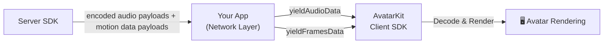

## What is Backend Mode with your own transport?

This is the [Backend Mode Integration](/backend-mode/overview) shape where **your application** owns the network connection between the Server SDK and the client. Your server sends encoded audio payloads and motion data payloads to your client, and the client SDK receives and **decodes them internally** for synchronized playback and rendering.

SDK Reference pages cover the exact enum and method names for each platform.

<Warning>
Backend Mode with your own transport **requires** the Server SDK to provide the encoded payloads. The data passed to `yieldAudioData()` and `yieldFramesData()` are encoded audio payloads and motion data payloads from the Server SDK — not raw audio or motion data you create yourself.
</Warning>

## When to use

- **Custom network layer** — you manage the connection between your client and AvatarKit's server SDK yourself.
- **Third-party realtime transport** — messages are relayed through a provider such as LiveKit. (See [Backend Mode with LiveKit](/backend-mode/with-livekit) for that variant.)
- **Proxy architecture** — your backend acts as a relay between the client and Motion Server.

## Requirements

| Requirement | Description |
|-------------|-------------|
| **App ID** | Obtained from [Spatius Studio](https://app.spatius.ai). |
| **Session Token** | **Not required** on the client side. |
| **Server SDK** | Your backend must integrate with the Server SDK to provide payloads for clients. |

## Direct Mode vs Backend Mode (own transport)

| Aspect | Direct Mode | Backend Mode (own transport) |
|--------|----------|-----------|
| **Network** | Client SDK connects to Motion Server directly. | Your app relays payloads from the Server SDK. |
| **Message decoding** | Handled internally. | Handled internally (same). |
| **Session Token** | Required (client-side). | Not required (client-side). |
| **Server SDK** | Not needed. | **Required** on your backend. |
| **Key methods** | `send()`, `start()`, `close()` | `yieldAudioData()`, `yieldFramesData()` |

## Key Concepts

### ConversationId Management

ConversationId links encoded audio payloads and motion data payloads for a single conversation session:

1. Call `yieldAudioData()` — returns a `conversationId`.
2. Use that `conversationId` when calling `yieldFramesData()`.
3. Messages with a **mismatched** conversationId will be **discarded**.

<Warning>
**Important:** Always use the conversationId returned by `yieldAudioData()` when sending motion data payloads. Mismatched IDs cause payloads to be silently dropped.
</Warning>

### Fallback Mechanism

If you provide empty motion data (empty array or undefined), the SDK automatically enters **audio-only mode** for that session. Once in audio-only mode, any subsequent motion data for that session is ignored — only audio continues playing.

## Next steps

<CardGroup cols={2}>
  <Card title="Browse all demos" icon="github" href="/resources/demo-projects">
    Run the Backend Mode reference implementations for Web, iOS, Android, and Flutter.
  </Card>
  <Card title="Backend Mode with LiveKit" icon="tower-broadcast" href="/backend-mode/with-livekit">
    Reuse a LiveKit room as the downstream transport instead of your own WebSocket.
  </Card>
</CardGroup>
