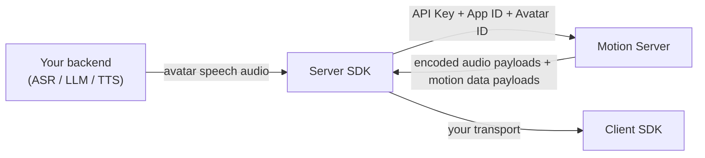

The Server SDK is the required backend side of Backend Mode Integration. It authenticates with your Spatius API Key, opens the Motion Server connection, sends avatar speech audio, and receives encoded audio payloads and motion data payloads.

## Responsibilities

| Server SDK responsibility | Description |
| --- | --- |
| **Authenticate** | Use the backend-only API Key to create and start an avatar session. |
| **Connect to Motion Server** | Own the WebSocket connection to Spatius. |
| **Send avatar speech audio** | Send the TTS output or other avatar speech audio to Motion Server. See [Audio](/concepts/audio). |
| **Receive encoded payloads** | Receive the encoded audio payloads and motion data payloads your clients will render. |
| **Hand off to transport** | Deliver those encoded payloads to clients over your own WebSocket, LiveKit Room, or another transport. |

<Note>
Client apps do not use your API Key. In Backend Mode Integration, your backend owns the Spatius credentials and Motion Server connection.
</Note>

## Next steps

<CardGroup cols={2}>
  <Card title="Python Server SDK" icon="python" href="/sdk-reference/python-sdk/python-sdk">
    Session lifecycle, audio input, callbacks, and egress options.
  </Card>
  <Card title="Go Server SDK" icon="code" href="/sdk-reference/go-sdk/go-sdk">
    Go backend SDK reference and lifecycle.
  </Card>
</CardGroup>

<CardGroup cols={1}>
  <Card title="Browse all demos" icon="github" href="/resources/demo-projects">
    Every runnable demo by platform and integration path.
  </Card>
</CardGroup>
