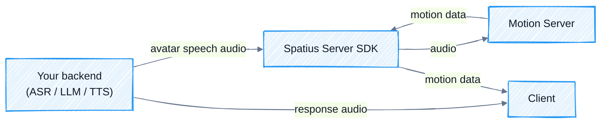

In Backend Mode Integration, your backend sends avatar speech audio to Motion Server, then delivers the response audio and returned motion data to each client.

<div style={{ backgroundColor: '#ffffff', border: '1px solid #e5e7eb', borderRadius: 12, padding: 12 }}>



</div>

## Before you start

Get the App ID and API Key from [Apps](https://app.spatius.ai/apps) (**Developer → API Key**) and the Avatar ID from the [Avatar Library](https://app.spatius.ai/avatars/library).

Keep the API Key on your backend. The App ID and Avatar ID must match the values used by the client.

## Run the Python reference implementation

The Backend Mode demo contains a complete Python backend and Web, iOS, Android, and Flutter clients:

```bash
git clone https://github.com/spatius-ai/spatius-integration-demo.git
cd spatius-integration-demo/backend-mode
cp servers/python/.env.example servers/python/.env
# Fill the required values in servers/python/.env
./start.sh
```

Open the URL printed by the script, initialize the Avatar, then send text or microphone input.

## Build your backend

<Steps>
<Step title="Install a Server SDK">

<Tabs>
<Tab title="Python">

```bash
pip install spatius
```

</Tab>
<Tab title="Go">

```bash
go get github.com/spatius-ai/spatius-sdk-go
```

</Tab>
</Tabs>

</Step>

<Step title="Create and start an Avatar session">

Configure the session with the API Key, App ID, Avatar ID, region, audio format, and a motion data callback. Then initialize the session and open its Motion Server connection.

<Tabs>
<Tab title="Python">

```python
from datetime import datetime, timedelta, timezone
from spatius import AudioFormat, new_avatar_session

session = new_avatar_session(
    api_key="your-api-key",
    app_id="your-app-id",
    avatar_id="your-avatar-id",
    region="us-west",
    expire_at=datetime.now(timezone.utc) + timedelta(minutes=5),
    sample_rate=16000,
    audio_format=AudioFormat.PCM_S16LE,
    transport_frames=lambda payload, last: print(
        f"Motion payload: {len(payload)} bytes, last={last}"
    ),
)

await session.init()
connection_id = await session.start()
print(f"Connected: {connection_id}")
```

</Tab>
<Tab title="Go">

```go
package avatar

import (
	"context"
	"log"
	"time"

	spatius "github.com/spatius-ai/spatius-sdk-go"
)

func StartSession(ctx context.Context) (*spatius.AvatarSession, error) {
	session := spatius.NewAvatarSession(
		spatius.WithAPIKey("your-api-key"),
		spatius.WithAppID("your-app-id"),
		spatius.WithAvatarID("your-avatar-id"),
		spatius.WithRegion("us-west"),
		spatius.WithExpireAt(time.Now().Add(5*time.Minute).UTC()),
		spatius.WithSampleRate(16000),
		spatius.WithAudioFormat(spatius.AudioFormatPCMS16LE),
		spatius.WithTransportFrames(func(payload []byte, last bool) {
			log.Printf("Motion payload: %d bytes, last=%t", len(payload), last)
		}),
	)

	if err := session.Init(ctx); err != nil {
		return nil, err
	}

	connectionID, err := session.Start(ctx)
	if err != nil {
		_ = session.Close()
		return nil, err
	}
	log.Printf("Connected: %s", connectionID)

	return session, nil
}
```

</Tab>
</Tabs>

</Step>

<Step title="Deliver one response turn">

Assign the response a turn ID. Send its audio to the client first, then send the same audio to Spatius. Forward every motion data payload from the Server SDK callback to the client with that turn ID. Keep response turns serial unless your delivery layer can route overlapping callbacks correctly.

Your application transport can be WebSocket or HTTP streaming. It must preserve message order and the turn ID. See the [complete Python implementation](https://github.com/spatius-ai/spatius-integration-demo/blob/main/backend-mode/servers/python/app/session.py) or the [Go SDK lifecycle](/sdk-reference/go-sdk/go-sdk#session-lifecycle).

</Step>

<Step title="Cancel or close">

Stop forwarding a discarded turn when the conversation is cancelled, and close the Avatar session when the client leaves. Exact lifecycle APIs are listed in the Server SDK Reference.

</Step>
</Steps>

## Next steps

<CardGroup cols={3}>
  <Card title="Client" icon="display" href="/backend-mode/client-sdk" />
  <Card title="Python Server SDK" icon="python" href="/sdk-reference/python-sdk/python-sdk" />
  <Card title="Go Server SDK" icon="code" href="/sdk-reference/go-sdk/go-sdk" />
</CardGroup>
