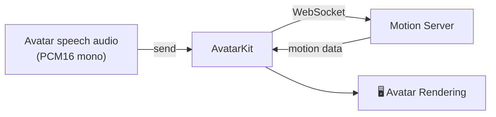

## What is Basic Mode?

Basic Mode is the **default** integration mode. AvatarKit handles the client-side connection to Motion Server — you send avatar speech audio, and AvatarKit takes care of receiving motion data, synchronizing playback, and rendering.



## When to Use

- **Real-time avatar speech audio** — TTS or audio file playback driving an avatar
- **Simplest integration** — minimal code, SDK handles networking
- **Server-side processing** — motion data is generated by Motion Server

## Requirements

| Requirement | Description |
|-------------|-------------|
| **App ID** | Obtained from [Spatius Studio](https://app.spatius.ai) |
| **Session Token** | Obtained from your backend server (max 24 hours validity) |
| **Audio Format** | PCM16, mono, configurable sample rate (default 16000 Hz) |

<Note>
**Authentication Flow:**
```
Your Client → Your Backend → Motion Server → Session Token (24 hours max)
```
The Session Token must be set before calling `start()`. See the platform-specific guides below for details.
</Note>

## Platform Comparison

| Feature | Web | iOS | Android |
|---------|-----|-----|---------|
| **Package** | `@spatialwalk/avatarkit` | `AvatarKit.xcframework` / SPM | `ai.spatialwalk:avatarkit` |
| **Rendering** | WebGL / WebGPU | Metal | Vulkan |
| **UI Framework** | DOM Canvas | UIKit + SwiftUI wrapper | Android View + Compose wrapper |
| **Audio Init** | `initializeAudioContext()` in user gesture | Automatic | Automatic |
| **Build Config** | Vite plugin / Next.js wrapper required | Xcode linker flags | Gradle dependency |

## Key Concepts

### Fallback Mechanism

If the WebSocket connection fails within 15 seconds, the SDK automatically enters **audio-only fallback mode** — audio continues to play normally without animation. This ensures uninterrupted audio playback even when the server is unreachable.

### ConversationId

Every `send()` call returns a `conversationId` that identifies the current conversation round. When `end: true` is passed, it marks the end of audio input — the avatar will continue playing remaining animation until finished, then automatically return to idle (notified via `onConversationState`). Sending new audio after that starts a new round and interrupts any ongoing playback.

## Get Started

<CardGroup cols={3}>
  <Card title="Web" icon="globe" href="/basic-mode/web">
    JavaScript / TypeScript
  </Card>
  <Card title="iOS Demo" icon="apple" href="https://github.com/spatialwalk/avatar-kit-ios-demo">
    Use the GitHub demo as the iOS guide
  </Card>
  <Card title="Android Demo" icon="android" href="https://github.com/spatialwalk/avatar-kit-android-demo">
    Use the GitHub demo as the Android guide
  </Card>
</CardGroup>
