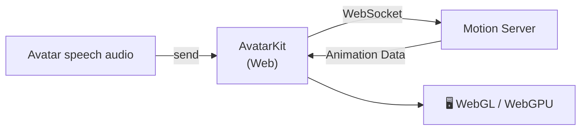

<CardGroup cols={1}>
  <Card title="Web Demo Repository" icon="github" href="https://github.com/spatialwalk/avatar-kit-web-demo">
    Complete working examples for Vanilla JS, Vue, and React — the fastest way to get started.
  </Card>
</CardGroup>

## Installation

<Tabs>
<Tab title="pnpm">

```bash
pnpm add @spatialwalk/avatarkit
```

</Tab>
<Tab title="npm">

```bash
npm install @spatialwalk/avatarkit
```

</Tab>
<Tab title="yarn">

```bash
yarn add @spatialwalk/avatarkit
```

</Tab>
</Tabs>

## Build Tool Configuration

<Warning>
**Required:** The SDK uses WASM files that need special build configuration. You **must** configure your build tool before using the SDK.
</Warning>

<Tabs>
<Tab title="Vite">

Add the official plugin to `vite.config.ts`:

```typescript title="vite.config.ts"
import { defineConfig } from 'vite'
import { avatarkitVitePlugin } from '@spatialwalk/avatarkit/vite'

export default defineConfig({
  plugins: [
    avatarkitVitePlugin(),
  ],
})
```

<Accordion title="Plugin Features">

The plugin automatically handles:

- **Development Server**: Sets correct MIME type for WASM files
- **Build Time**: Copies WASM files to `dist/assets/`
- **Cloudflare Pages**: Generates `_headers` file
- **Vite Configuration**: Configures `optimizeDeps`, `assetsInclude`, etc.

</Accordion>

<Accordion title="Manual Configuration (Without Plugin)">

```typescript title="vite.config.ts"
import { defineConfig } from 'vite'

export default defineConfig({
  optimizeDeps: {
    exclude: ['@spatialwalk/avatarkit'],
  },
  assetsInclude: ['**/*.wasm'],
  build: {
    assetsInlineLimit: 0,
    rollupOptions: {
      output: {
        assetFileNames: (assetInfo) => {
          if (assetInfo.name?.endsWith('.wasm')) {
            return 'assets/[name][extname]'
          }
          return 'assets/[name]-[hash][extname]'
        },
      },
    },
  },
  configureServer(server) {
    server.middlewares.use((req, res, next) => {
      if (req.url?.endsWith('.wasm')) {
        res.setHeader('Content-Type', 'application/wasm')
      }
      next()
    })
  },
})
```

</Accordion>

</Tab>
<Tab title="Next.js">

Wrap your config in `next.config.mjs`:

```javascript title="next.config.mjs"
import { withAvatarkit } from '@spatialwalk/avatarkit/next'

export default withAvatarkit({
  // ...your existing Next.js config
})
```

<Accordion title="Wrapper Features">

The wrapper automatically handles:

- **Emscripten Fix**: Patches `scriptDirectory` so the WASM glue file correctly resolves assets at `/_next/static/chunks/`
- **WASM Copying**: Copies `.wasm` files into `static/chunks/` via a custom webpack plugin (client build only)
- **Content-Type Headers**: Adds `application/wasm` response header for `/_next/static/chunks/*.wasm`
- **Config Chaining**: Preserves your existing `webpack` and `headers` configurations

</Accordion>

<Accordion title="Multiple Config Wrappers">

If you have multiple config wrappers, `withAvatarkit` must wrap your entire config:

```javascript title="next.config.mjs"
import { withAvatarkit } from '@spatialwalk/avatarkit/next'
import withOtherPlugin from 'other-plugin'

export default withAvatarkit(withOtherPlugin({
  // ...your config
}))
```

</Accordion>

</Tab>
</Tabs>

## Authentication

Basic Mode requires an **App ID** and a **Session Token**.

| Credential | How to Obtain | Notes |
|------------|---------------|-------|
| **App ID** | [Spatius Studio](https://app.spatius.ai) → Create App | Required for all modes |
| **Session Token** | Your backend server requests it from Motion Server | Max 24 hours validity |

<Note>
**Authentication Flow:**
```
Your Client → Your Backend → Motion Server → Session Token (24 hours max)
```
The Session Token must be set before calling `start()`. Never expose your token generation logic in client-side code.
</Note>

## Quick Start

<Steps>
<Step title="Initialize SDK">

```typescript
import {
  AvatarSDK,
  Environment,
  DrivingServiceMode,
} from '@spatialwalk/avatarkit'

await AvatarSDK.initialize('your-app-id', {
  environment: Environment.intl,  // or Environment.cn
  drivingServiceMode: DrivingServiceMode.sdk,  // Default
})

// Set Session Token (required before start())
AvatarSDK.setSessionToken('your-session-token')
```

</Step>
<Step title="Load Avatar">

```typescript
import { AvatarManager } from '@spatialwalk/avatarkit'

const avatar = await AvatarManager.shared.load('avatar-id', (progress) => {
  console.log(`Loading: ${progress.progress}%`)
})
```

</Step>
<Step title="Create View">

```typescript
import { AvatarView } from '@spatialwalk/avatarkit'

// Container MUST have non-zero width and height
const container = document.getElementById('avatar-container')!
const avatarView = new AvatarView(avatar, container)
```

</Step>
<Step title="Initialize Audio Context">

<Warning>
**Critical:** `initializeAudioContext()` **must** be called inside a user gesture handler (e.g., `click`, `touchstart`). This is a browser security requirement — calling it outside a user gesture will fail silently.
</Warning>

```typescript
button.addEventListener('click', async () => {
  await avatarView.controller.initializeAudioContext()
})
```

</Step>
<Step title="Connect and Send Audio">

```typescript
// Start WebSocket connection to Motion Server
// Note: start() initiates the connection asynchronously.
// Wait for onConnectionState === 'connected' before calling send().
await avatarView.controller.start()

// Wait for connection to be ready
await new Promise<void>((resolve, reject) => {
  avatarView.controller.onConnectionState = (state) => {
    if (state === ConnectionState.connected) resolve()
    else if (state === ConnectionState.failed) reject(new Error('Connection failed'))
  }
})

// Send audio data (PCM16, mono, matching configured sample rate)
const audioData: ArrayBuffer = /* your PCM16 audio data */
avatarView.controller.send(audioData, false)  // Continue sending

// Mark end of audio input for current conversation round
// The avatar will continue playing remaining animation until finished,
// then automatically return to idle (notified via onConversationState).
avatarView.controller.send(lastChunk, true)
```

</Step>
<Step title="Cleanup">

```typescript
avatarView.controller.close()  // Close WebSocket connection
avatarView.dispose()           // Release all resources
```

</Step>
</Steps>

## Core API

### AvatarSDK

SDK initialization and global configuration.

```typescript
// Initialize
await AvatarSDK.initialize(appId: string, configuration: Configuration)

// Properties (read-only)
AvatarSDK.isInitialized   // boolean
AvatarSDK.appId           // string
AvatarSDK.configuration   // Configuration
AvatarSDK.version         // string
AvatarSDK.sessionToken    // string

// Methods
AvatarSDK.setSessionToken(token: string)  // Set auth token
AvatarSDK.setUserId(userId: string)       // Set user ID (for telemetry)
AvatarSDK.cleanup()                       // Release all SDK resources
```

<Note>
`setSessionToken()` can be called before or after `initialize()`. If called before, the token is applied automatically during initialization.
</Note>

### AvatarManager

Avatar resource loading and caching. Access via the singleton `AvatarManager.shared`.

```typescript
const manager = AvatarManager.shared

// Load avatar (downloads and caches)
const avatar = await manager.load(
  id: string,
  onProgress?: (progress: LoadProgressInfo) => void
)

// Clear all cached resources
manager.clearAll()
```

| Parameter | Type | Description |
|-----------|------|-------------|
| `id` | `string` | Avatar character ID |
| `onProgress` | `(progress) => void` | Progress callback with `{ progress: number }` (0–100) |

### AvatarView

3D rendering view. Automatically creates a Canvas element and an `AvatarController`.

```typescript
// Create view — Canvas is added to container automatically
const avatarView = new AvatarView(avatar: Avatar, container: HTMLElement)
```

| Property / Method | Type | Description |
|-------------------|------|-------------|
| `controller` | `AvatarController` | Playback controller (read-only) |
| `transform` | `{ x, y, scale }` | Avatar position and scale |
| `onFirstRendering` | `() => void` | Callback when first frame renders |
| `dispose()` | `void` | Release all resources |

**Transform coordinates:**

| Field | Range | Description |
|-------|-------|-------------|
| `x` | -1 to 1 | Horizontal offset (-1 = left, 0 = center, 1 = right) |
| `y` | -1 to 1 | Vertical offset (-1 = bottom, 0 = center, 1 = top) |
| `scale` | > 0 | Scale factor (1.0 = original size) |

<Warning>
**Container requirement:** The container element **must** have non-zero `width` and `height`. The Canvas fills the container and auto-resizes via `ResizeObserver`.
</Warning>

### AvatarController — Basic Mode Methods

These methods are only available when `drivingServiceMode` is `DrivingServiceMode.sdk`.

```typescript
// Initialize audio (MUST be in user gesture handler)
await controller.initializeAudioContext()

// Connect to Motion Server
await controller.start()

// Send audio data — returns conversationId
const conversationId = controller.send(
  audioData: ArrayBuffer,  // PCM16, mono
  end: boolean             // true = end of conversation round
)

// Close connection
controller.close()
```

**`send()` behavior:**
- `end: false` — continues the current conversation round
- `end: true` — marks the end of audio input for the current round. The avatar will continue playing remaining animation until finished, then automatically return to idle (notified via `onConversationState`). Sending new audio after this starts a new round and interrupts any ongoing playback

### AvatarController — Common Methods

Available in both Basic Mode and Host Mode.

```typescript
// Playback control
controller.pause()       // Pause audio + animation
controller.resume()      // Resume playback
controller.interrupt()   // Stop current playback, clear data

// Data management
controller.clear()       // Clear all data and resources

// Conversation
controller.getCurrentConversationId()  // string | null

// Volume (affects avatar audio only, not system volume)
controller.setVolume(volume: number)   // 0.0 to 1.0
controller.getVolume(): number         // Current volume
```

### AvatarController — Event Callbacks

```typescript
// Connection state changes (Basic Mode only)
controller.onConnectionState = (state: ConnectionState) => {
  console.log('Connection:', state)
}

// Conversation state changes
controller.onConversationState = (state: ConversationState) => {
  console.log('Conversation:', state)
}

// Error handler
controller.onError = (error: AvatarError) => {
  console.error('Error:', error.code, error.message)
}
```

## Audio Format

The SDK requires audio in **mono PCM16** format:

| Property | Value |
|----------|-------|
| **Format** | PCM16 (16-bit signed integer, little-endian) |
| **Channels** | Mono (1 channel) |
| **Sample Rate** | Configurable: 8000, 16000, 22050, 24000, 32000, 44100, 48000 Hz (default: 16000) |
| **Data Type** | `ArrayBuffer` or `Uint8Array` |

**Data size:** 1 second at 16 kHz = 16,000 samples × 2 bytes = 32,000 bytes.

<Accordion title="Converting MP3 to PCM16">

```typescript
async function mp3ToPcm16(mp3File: File, targetSampleRate: number): Promise<ArrayBuffer> {
  const arrayBuffer = await mp3File.arrayBuffer()
  const audioContext = new AudioContext({ sampleRate: targetSampleRate })
  const audioBuffer = await audioContext.decodeAudioData(arrayBuffer.slice(0))

  const length = audioBuffer.length
  const channels = audioBuffer.numberOfChannels
  const pcm16Buffer = new ArrayBuffer(length * 2)
  const pcm16View = new DataView(pcm16Buffer)

  // Mix to mono if stereo
  const mono = channels === 1
    ? audioBuffer.getChannelData(0)
    : (() => {
        const mixed = new Float32Array(length)
        const left = audioBuffer.getChannelData(0)
        const right = audioBuffer.getChannelData(1)
        for (let i = 0; i < length; i++) mixed[i] = (left[i] + right[i]) / 2
        return mixed
      })()

  // Float32 → Int16
  for (let i = 0; i < length; i++) {
    const s = Math.max(-1, Math.min(1, mono[i]))
    pcm16View.setInt16(i * 2, s < 0 ? s * 0x8000 : s * 0x7FFF, true)
  }

  audioContext.close()
  return pcm16Buffer
}
```

</Accordion>

## Configuration

### Configuration Interface

```typescript
interface Configuration {
  environment: Environment
  drivingServiceMode?: DrivingServiceMode  // Default: DrivingServiceMode.sdk
  logLevel?: LogLevel                      // Default: LogLevel.off
  audioFormat?: AudioFormat                // Default: { channelCount: 1, sampleRate: 16000 }
}
```

### Environment

```typescript
enum Environment {
  cn = 'cn',      // China region
  intl = 'intl',  // International region
}
```

### DrivingServiceMode

```typescript
enum DrivingServiceMode {
  sdk = 'sdk',    // Server-driven (default)
  host = 'host',  // Client-driven
}
```

### AudioFormat

```typescript
interface AudioFormat {
  readonly channelCount: 1   // Fixed to mono
  readonly sampleRate: number // 8000 | 16000 | 22050 | 24000 | 32000 | 44100 | 48000
}
```

### LogLevel

```typescript
enum LogLevel {
  off = 'off',          // No logging (default)
  error = 'error',      // Errors only
  warning = 'warning',  // Errors + warnings
  all = 'all',          // All logs
}
```

## State Management

### ConnectionState

Reported via `onConnectionState` callback (Basic Mode only).

```typescript
enum ConnectionState {
  disconnected = 'disconnected',
  connecting = 'connecting',
  connected = 'connected',
  failed = 'failed',
}
```

### ConversationState

Reported via `onConversationState` callback.

```typescript
enum ConversationState {
  idle = 'idle',        // Breathing animation, waiting for input
  playing = 'playing',  // Active conversation playback
  pausing = 'pausing',  // Paused during playback
}
```

<Note>
State transitions are notified immediately when the transition starts, not when the animation completes. For example, `playing` is reported as soon as the transition from `idle` begins.
</Note>

## Error Handling

### AvatarError

```typescript
import { AvatarError } from '@spatialwalk/avatarkit'

try {
  await avatarView.controller.start()
} catch (error) {
  if (error instanceof AvatarError) {
    console.error('SDK error:', error.message, error.code)
  }
}
```

### Error Callback

```typescript
avatarView.controller.onError = (error: AvatarError) => {
  console.error('Controller error:', error.code, error.message)
}
```

## Lifecycle Management

### Avatar Switching

```typescript
// 1. Dispose current view
currentAvatarView.dispose()

// 2. Load new avatar
const newAvatar = await AvatarManager.shared.load('new-avatar-id')

// 3. Create new view (reuse same container)
currentAvatarView = new AvatarView(newAvatar, container)

// 4. Reconnect
await currentAvatarView.controller.initializeAudioContext()
await currentAvatarView.controller.start()
```

### Resource Cleanup

`dispose()` automatically cleans up all resources:

- WebSocket connections
- Audio playback data and animation resources
- Canvas elements and render system
- Event listeners and callbacks

<Warning>
Always call `dispose()` when the view is no longer needed. Failing to do so may cause memory leaks.
</Warning>

### Fallback Mechanism

If the WebSocket connection fails within 15 seconds, the SDK automatically enters **audio-only fallback mode** — audio continues playing without animation. This ensures uninterrupted audio playback when the server is unreachable.

- The fallback mode is interruptible like normal playback
- `onConnectionState` reports `failed` when the connection times out

## Browser Compatibility

| Browser | Minimum Version | Rendering |
|---------|-----------------|-----------|
| Chrome / Edge | 90+ | WebGPU (preferred) |
| Firefox | 90+ | WebGL |
| Safari | 14+ | WebGL |
| iOS Safari | 14+ | WebGL |
| Android Chrome | 90+ | WebGL |

## Common Issues

| Issue | Cause | Solution |
|-------|-------|----------|
| Audio not working | `initializeAudioContext()` not in user gesture | Call it inside a `click` or `touchstart` handler |
| Avatar not rendering | Container has zero dimensions | Set explicit `width` and `height` on the container |
| WASM MIME type error | Build tool misconfiguration | Use Vite plugin or Next.js wrapper |
| Session Token invalid | Token expired or not set | Refresh token from backend, call `setSessionToken()` before `start()` |
| WebSocket connection failed | Network or auth issue | Check network connectivity and token validity |
