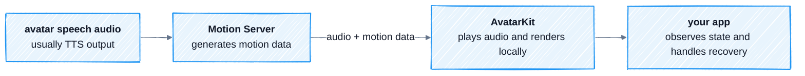

Spatius does not stream a video of the Avatar. It takes the audio the Avatar should speak, turns that audio into motion data, and lets AvatarKit render the Avatar on the user's device.

The short version:

```text
TTS audio -> Motion Server -> motion data -> AvatarKit -> Avatar moves on screen
```

The audio is usually TTS output from your agent response. It is not the user's microphone audio unless your product intentionally makes the Avatar repeat or relay that audio.

## What Happens

<div style={{ backgroundColor: '#ffffff', border: '1px solid #e5e7eb', borderRadius: 12, padding: 12 }}>



</div>

One Avatar response follows this sequence:

1. Your app chooses an Avatar and mounts an `AvatarView`.
2. Your app brings the connection online for the integration mode you use.
3. The audio the Avatar should say reaches Motion Server.
4. Motion Server generates motion data for that audio.
5. AvatarKit plays the audio and renders the matching Avatar movement locally.
6. State and error callbacks tell your app when the Avatar is idle, playing, paused, failed, or ready to retry.

## What Each Component Does

| Component | Role |
|-----------|------|
| **Your app** | Chooses the Avatar, provides avatar speech audio, controls lifecycle, interrupts responses, and handles recovery. |
| **Motion Server** | Receives avatar speech audio and generates motion data. |
| **AvatarKit** | Loads avatar assets, receives audio and motion data, plays audio, and renders the Avatar locally. |

This boundary is the most important idea on the page: Motion Server sends data, not video. AvatarKit renders on the device.

## Where Modes Differ

All modes use the same idea: audio in, motion data out, AvatarKit renders locally. The difference is who connects to Motion Server and how the output reaches AvatarKit.

| Mode | Motion Server connection | How AvatarKit gets data |
|------|--------------------------|--------------------------|
| **Basic Mode** | AvatarKit connects from the client. | AvatarKit receives audio and motion data directly. |
| **Custom Mode** | Your backend connects through the Spatius Server SDK. | Your backend forwards encoded audio and motion messages to AvatarKit. |
| **LiveKit Plugin** | The agent worker starts the plugin. | Motion Server publishes audio and motion data into the LiveKit room; AvatarKit receives room data. |

Use the mode pages for implementation details. This page is only the mental model.

## What Your App Still Owns

Spatius handles audio-to-motion and local rendering. Your product still decides:

- Which Avatar ID to load.
- Where avatar speech audio comes from.
- When to initialize, connect, interrupt, retry, and clean up.
- How to refresh tokens and recover from failed connections.
- What UI to show for loading, idle, playing, paused, and failed states.

## Where to Go Next

| If you are thinking about... | Read |
|------------------------------|------|
| Which digital human appears on screen | [Avatars](/concepts/avatars) |
| When to initialize, connect, and clean up | [Sessions & Lifecycle](/concepts/sessions-lifecycle) |
| Audio format, motion data, response end, or interruption | [Audio and Motion Data](/concepts/audio-io) |
| UI state, errors, token expiry, or reconnects | [State & Events](/concepts/state-events) |

## Common Failure Paths

| Symptom | Likely cause | Read |
|---------|--------------|------|
| Avatar does not appear | Avatar ID, assets, or view mount problem | [Avatars](/concepts/avatars) |
| Connection fails or token expires | Session Token or connection recovery problem | [State & Events](/concepts/state-events) |
| Audio is silent, distorted, or out of sync | Wrong audio format or sample rate | [Audio and Motion Data](/concepts/audio-io#avatar-speech-audio) |
| Audio plays but the Avatar does not move | Motion data is not reaching AvatarKit | [Audio and Motion Data](/concepts/audio-io#motion-data) |
| Playback never returns to idle | The response end was not marked correctly | [Audio and Motion Data](/concepts/audio-io#response-end-and-interruption) |
