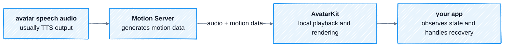

Spatius does not stream digital human video to the client. Instead, it **renders the Avatar locally on the client**. The cloud only transmits motion data, and client renders the Avatar in real time.

## Overall Flow

```mermaid actions={false}
---
config:
  "look": "handDrawn"
  "theme": "base"
  "themeVariables":
    "background": "#ffffff"
    "textColor": "#111827"
    "lineColor": "#64748b"
    "primaryColor": "#e8f4fd"
    "primaryTextColor": "#111827"
    "primaryBorderColor": "#2196F3"
    "secondaryColor": "#f3e5f5"
    "secondaryTextColor": "#111827"
    "secondaryBorderColor": "#9C27B0"
    "tertiaryColor": "#fff3e0"
    "tertiaryTextColor": "#111827"
    "tertiaryBorderColor": "#FF9800"
    "clusterBkg": "#f8fafc"
    "clusterBorder": "#cbd5e1"
    "edgeLabelBackground": "#ffffff"
---
graph LR
    A["<b>avatar speech audio</b><br/>usually TTS output"]
    B["<b>Motion Server</b><br/>generates motion data"]
    C["<b>AvatarKit</b><br/>local playback and rendering"]
    D["<b>your app</b><br/>observes state and handles recovery"]

    A --> B
    B -->|"audio + motion data"| C
    C --> D
```

> For one Avatar response: the audio the Avatar should speak is sent to Motion Server, Motion Server generates motion data, AvatarKit plays the audio locally while rendering synchronized lip and body motion, and your app observes the process through state callbacks.

## Core Components

### AvatarKit Client SDK

The client SDK covers Web, iOS, Android, and Flutter. It renders the Avatar on the client and keeps the audio and digital human visuals synchronized.

Reference: [Web](/sdk-reference/web-sdk/reference) | [iOS](/sdk-reference/ios-sdk/api-reference) | [Android](/sdk-reference/android-sdk/api-reference) | [Flutter](/sdk-reference/flutter-sdk/api-reference)

### Motion Server

> Cloud service provided by Spatius.

- **Input**: audio, the audio the digital human should speak, usually the TTS output from an ASR -> LLM -> TTS pipeline.
- **Output**: motion data, about 20 KB/s, much lower than a video stream.
- **Role**: drives AvatarKit on the client to produce the digital human speaking visuals. **Audio-video synchronization is handled by the SDK, so application developers don't need to manage it.**

## Integration Modes

Different integration modes match different development scenarios.

| Integration | Description |
|------|-------------|
| **[Direct Mode](/direct-mode/overview)** | The simplest integration path. The client SDK connects directly to Motion Server, suitable for quickly integrating Web, iOS, Android, or Flutter apps. |
| **[LiveKit Agents Integration](/livekit-agents/overview)** | For projects already using the LiveKit Agents framework. Add `livekit-plugins-spatius` in a few lines. |
| **[Agora Convo AI Integration](/agora-convoai/overview)** | For projects already using Agora Convo AI. Configure Spatius as the Convo AI avatar provider, or use `spatius_avatar_python` when running a TEN Framework graph directly. |
| **[Backend Mode](/backend-mode/overview)** | A custom integration path. Your backend uses the Server SDK and chooses a downstream transport such as your own WebSocket, LiveKit Room, or Agora channel. |

For mode selection, see [How to Integrate](/getting-started/how-to-integrate).
