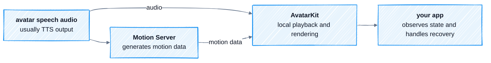

Spatius does not stream finished Avatar video to the client. Instead, it **renders the Avatar locally on the client**. Motion Server returns motion data rather than video; delivery depends on the selected integration.

## Overall Flow

```mermaid actions={false}
---
config:
  "look": "handDrawn"
  "theme": "base"
  "themeVariables":
    "background": "#ffffff"
    "textColor": "#111827"
    "lineColor": "#64748b"
    "primaryColor": "#e8f4fd"
    "primaryTextColor": "#111827"
    "primaryBorderColor": "#2196F3"
    "secondaryColor": "#f3e5f5"
    "secondaryTextColor": "#111827"
    "secondaryBorderColor": "#9C27B0"
    "tertiaryColor": "#fff3e0"
    "tertiaryTextColor": "#111827"
    "tertiaryBorderColor": "#FF9800"
    "clusterBkg": "#f8fafc"
    "clusterBorder": "#cbd5e1"
    "edgeLabelBackground": "#ffffff"
---
graph LR
    A["<b>avatar speech audio</b><br/>usually TTS output"]
    B["<b>Motion Server</b><br/>generates motion data"]
    C["<b>AvatarKit</b><br/>local playback and rendering"]
    D["<b>your app</b><br/>observes state and handles recovery"]

    A --> B
    A -->|"audio"| C
    B -->|"motion data"| C
    C --> D
```

> For one Avatar response: the audio the Avatar should speak is sent to Motion Server, Motion Server generates motion data, AvatarKit plays the audio locally while rendering synchronized lip and body motion, and your app observes the process through state callbacks.

## Core Components

### AvatarKit Client SDK

The client SDK covers Web, iOS, Android, and Flutter. It renders the Avatar on the client and keeps avatar speech audio and motion data synchronized.

Reference: [Web](/sdk-reference/web-sdk/reference) | [iOS](/sdk-reference/ios-sdk/api-reference) | [Android](/sdk-reference/android-sdk/api-reference) | [Flutter](/sdk-reference/flutter-sdk/api-reference)

### Motion Server

> Cloud service provided by Spatius.

- **Input**: avatar speech audio, usually the TTS output from an ASR -> LLM -> TTS pipeline.
- **Output**: motion data, ~10–15 KB/s, much lower than a video stream.
- **Role**: provides motion data that AvatarKit uses to animate the Avatar. **AvatarKit synchronizes audio and motion data playback, so application developers don't need to manage it.**

## Next steps

<CardGroup cols={2}>
  <Card title="Compare integrations" icon="plug" href="/integrations/overview" />
  <Card title="Run the Web quickstart" icon="bolt" href="/quickstarts/web-sdk" />
</CardGroup>
