AvatarKit follows the same client lifecycle across integrations. What changes is **who owns the connection and audio path**, not how the Avatar is loaded and rendered.

```mermaid actions={false}
---
config:
  "look": "handDrawn"
  "theme": "base"
  "themeVariables":
    "background": "#ffffff"
    "textColor": "#111827"
    "lineColor": "#64748b"
    "primaryColor": "#e8f4fd"
    "primaryTextColor": "#111827"
    "primaryBorderColor": "#2196F3"
---
graph LR
    A["<b>Initialize</b><br/>configure AvatarKit"]
    B["<b>Load</b><br/>download avatar assets"]
    C["<b>Render</b><br/>mount the Avatar view"]
    D["<b>Connect</b><br/>start or join the data path"]
    E["<b>Interact</b><br/>play, pause, interrupt"]
    F["<b>Cleanup</b><br/>release client resources"]

    A --> B --> C --> D --> E --> F
```

## Initialize

Initialize AvatarKit once when the application starts. This establishes shared configuration before any Avatar is loaded.

## Load

Load the selected `avatar-id` before creating its view. AvatarKit downloads and caches the avatar assets; loading the same Avatar again can reuse that cache.

See [Avatar](/concepts/avatar) for the asset mental model.

## Render

Mount the loaded Avatar into an Avatar view. The view owns the render surface and its controller, and can show idle animation before a conversation begins.

Treat the view and its controller as one lifecycle unit. Recreate or release them together when the Avatar changes.

## Connect

Connect only after the Avatar is ready to render. The selected integration determines the connection owner:

- In Direct Mode, AvatarKit connects to Motion Server.
- In the recommended integrations, the client joins the configured RTC room while the agent runtime owns the Motion Server session.
- In Backend Mode, your backend owns the Motion Server session and delivers data to the client.

Follow the setup and Client pages for your path from [Integrations](/integrations/overview). Do not reuse a Direct Mode connection sequence in another integration.

## Interact

During a response, AvatarKit keeps avatar speech audio and motion data synchronized. Your UI can observe conversation state and control playback, including pause, resume, and interruption.

See [Audio](/concepts/audio) for input timing and [Client State & Events](/concepts/state-events) for observable state.

## Cleanup

Release the Avatar view, controller, and any transport listeners when the screen or session ends. Cleanup behavior differs slightly by client platform; use the platform reference for the exact API:

[Web](/sdk-reference/web-sdk/reference#avatarview) · [iOS](/sdk-reference/ios-sdk/api-reference#avatarview) · [Android](/sdk-reference/android-sdk/api-reference#avatarview) · [Flutter](/sdk-reference/flutter-sdk/api-reference#render-and-control-playback)

<Warning>
Do not leave an old view or transport subscription alive after switching Avatars. Stale callbacks can update a view that is no longer visible.
</Warning>
