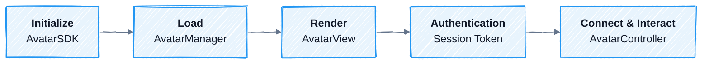

A session goes through five stages from SDK startup to view destruction, followed by Cleanup. Each stage corresponds to an AvatarKit class or a connection prerequisite.

<div style={{ backgroundColor: '#ffffff', border: '1px solid #e5e7eb', borderRadius: 12, padding: 12 }}>



</div>

## Stage 1: Initialize

Call `AvatarSDK.initialize(appId, configuration)` once when your app starts. This sets process-level configuration such as App ID, environment, audio format, driving mode, and log level.

AvatarKit must be initialized before you load an Avatar or create a view.

Reference: [Web](/sdk-reference/web-sdk/reference#avatarsdk) | [iOS](/sdk-reference/ios-sdk/api-reference#avatarsdk) | [Android](/sdk-reference/android-sdk/api-reference#avatarsdk)

## Stage 2: Load Avatar

`AvatarManager.load(id, onProgress?)` downloads avatar assets by `avatar-id` and returns an `Avatar` instance. In-flight loads for the same ID are reused, and successful loads are cached.

| Method | Purpose |
|--------|---------|
| `load(id, onProgress?)` | Downloads and returns an Avatar instance. |
| `clear(id)` | Deletes the cache for a specific Avatar. |
| `clearAll()` | Deletes all Avatar caches. |

The `onProgress` callback has three states: `downloading`, `completed`, and `failed`. `progress` ranges from 0 to 1.

Reference: [Web](/sdk-reference/web-sdk/reference#avatarmanager) | [iOS](/sdk-reference/ios-sdk/api-reference#avatarmanager) | [Android](/sdk-reference/android-sdk/api-reference#avatarmanager)

## Stage 3: Render

Mount the loaded `Avatar` into an `AvatarView`. The view creates the render surface and **automatically creates the associated `AvatarController`**. Do not construct the controller directly.

After mounting:

- The Avatar can play idle animation.
- Your app can access the `AvatarController`.
- Once the connection path is online and motion data arrives, playback can start.

| Callback | When it fires |
|----------|---------------|
| `onFirstRendering` | The first frame has been rendered. |

Reference: [Web](/sdk-reference/web-sdk/reference#avatarview) | [iOS](/sdk-reference/ios-sdk/api-reference#avatarview) | [Android](/sdk-reference/android-sdk/api-reference#avatarview)

## Stage 4: Authentication

Authentication must be completed before connecting. Authentication is not just client configuration: your backend uses the API key to request a Session Token from Motion Server, then returns that Session Token to the client. The API key must only be stored on the server. Do not put it in app or browser code.

Authentication ownership differs by mode:

| Mode | Who obtains the Session Token | What the client does |
|------|-------------------------------|----------------------|
| **Basic Mode** | Your backend requests it from Motion Server. | Sets a valid Session Token before calling `controller.start()`. |
| **LiveKit Plugin** | The agent worker or backend handles Motion Server authentication. | Uses a LiveKit room token to join the room. |
| **Custom Mode** | Your backend Server SDK handles Motion Server authentication. | Usually does not directly hold the Motion Server Session Token. |

<Note>
Session Tokens are used to establish connections. Expired or invalid tokens cause new connections to fail. To reconnect, fetch a new token from your backend first, then restart the connection path for the mode you use.
</Note>

For details, see [API Reference: Authentication](/api-reference/auth).

## Stage 5: Connect & Interact

Use `AvatarController` to start connections, send and receive data, and control playback. **Connection ownership differs by mode in this stage**:

| Mode | Connection owner | What your app does |
|------|------------------|--------------------|
| **Basic Mode** | Client-side AvatarKit connects directly to Motion Server. | Set the Session Token, call `controller.start()`, then call `send(audio, end)` to send audio. |
| **LiveKit Plugin** | The agent worker starts the plugin, and Motion Server pushes data into the LiveKit room. | The client joins the room, and AvatarKit automatically renders from the room. |
| **Custom Mode** | Backend Server SDK connects to Motion Server. | The backend starts the session and feeds audio + motion data to the client's `yield()` through your custom transport. |

<Warning>
Do not treat `controller.start()` as a universal connection step. It is only the Basic Mode client connection path. In Custom Mode and LiveKit Plugin integrations, the Motion Server connection is established outside the client.
</Warning>

| Method | Purpose |
|--------|---------|
| `start()` | Starts the Motion Server connection in Basic Mode. |
| `send(audio, end)` | Sends avatar speech audio in Basic Mode. |
| `yield(...)` | Feeds audio or motion data in Custom Mode. |
| `interrupt()` | Interrupts the current response and clears buffers. |
| `pause()` / `resume()` | Pauses or resumes while keeping buffers. |
| `close()` | Closes the connection. |

For state observation, see [State & Events](/concepts/state-events).

Reference: [Web](/sdk-reference/web-sdk/reference#avatarcontroller) | [iOS](/sdk-reference/ios-sdk/api-reference#avatarcontroller) | [Android](/sdk-reference/android-sdk/api-reference#avatarcontroller)

## Cleanup

Release resources when the Avatar is no longer used.

<Tabs>
  <Tab title="Web">
    ```typescript
    avatarView.dispose()
    ```
  </Tab>
  <Tab title="iOS">
    ```swift
    // Resources are released automatically when AvatarView is removed from the view hierarchy.
    // No explicit cleanup is required.
    ```
  </Tab>
  <Tab title="Android">
    ```kotlin
    avatarView.dispose()
    ```
  </Tab>
</Tabs>

<Warning>
Web and Android must explicitly call `dispose()`. iOS cleans up automatically when the view is released.
</Warning>

Reference: [Web `AvatarView`](/sdk-reference/web-sdk/reference#avatarview) | [iOS `AvatarView`](/sdk-reference/ios-sdk/api-reference#avatarview) | [Android `AvatarView`](/sdk-reference/android-sdk/api-reference#avatarview)
