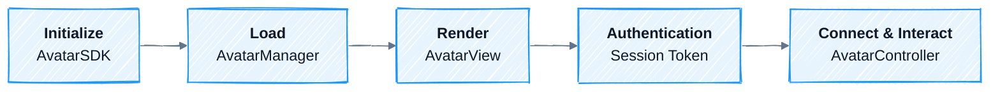

A session goes through five stages from SDK startup to view destruction, followed by Cleanup. Each stage corresponds to an AvatarKit class or a connection prerequisite.

<div style={{ backgroundColor: '#ffffff', border: '1px solid #e5e7eb', borderRadius: 12, padding: 12 }}>



</div>

## Stage 1: Initialize

Call `AvatarSDK.initialize(appId, configuration)` once when your app starts. This sets process-level configuration such as App ID, region, audio format, driving mode, and log level.

AvatarKit must be initialized before you load an Avatar or create a view.

Reference: [Web](/sdk-reference/web-sdk/reference#avatarsdk) | [iOS](/sdk-reference/ios-sdk/api-reference#avatarsdk) | [Android](/sdk-reference/android-sdk/api-reference#avatarsdk) | [Flutter](/sdk-reference/flutter-sdk/api-reference#initialize)

## Stage 2: Load Avatar

`AvatarManager.load(id, onProgress?)` downloads avatar assets by `avatar-id` and returns an `Avatar` instance. In-flight loads for the same ID are reused, and successful loads are cached.

| Method | Purpose |
|--------|---------|
| `load(id, onProgress?)` | Downloads and returns an Avatar instance. |
| `clear(id)` | Deletes the cache for a specific Avatar. |
| `clearAll()` | Deletes all Avatar caches. |

The `onProgress` callback has three states: `downloading`, `completed`, and `failed`. `progress` ranges from 0 to 1.

Reference: [Web](/sdk-reference/web-sdk/reference#avatarmanager) | [iOS](/sdk-reference/ios-sdk/api-reference#avatarmanager) | [Android](/sdk-reference/android-sdk/api-reference#avatarmanager) | [Flutter](/sdk-reference/flutter-sdk/api-reference#load-an-avatar)

## Stage 3: Render

Mount the loaded `Avatar` into an `AvatarView`. The view creates the render surface and **automatically creates the associated `AvatarController`**. Do not construct the controller directly.

After mounting:

- The Avatar can play idle animation.
- Your app can access the `AvatarController`.
- Once the connection path is online and motion data arrives, playback can start.

| Callback | When it fires |
|----------|---------------|
| `onFirstRendering` | The first frame has been rendered. |

Reference: [Web](/sdk-reference/web-sdk/reference#avatarview) | [iOS](/sdk-reference/ios-sdk/api-reference#avatarview) | [Android](/sdk-reference/android-sdk/api-reference#avatarview) | [Flutter](/sdk-reference/flutter-sdk/api-reference#render-and-control-playback)

## Stage 4: Authentication

Authentication differs by integration path. Only Direct Mode requires the client to hold a Spatius Session Token; the other paths authenticate inside their own transport.

| Integration | What the client needs before connecting | Where credentials live |
|------|-----------------------------------------|------------------------|
| **Direct Mode** | A valid **Session Token** set via `AvatarSDK.setSessionToken()` before `controller.start()`. Your backend exchanges your API Key for the Session Token via the Spatius Console API, then returns it to the client. | API Key on your backend; Session Token issued per session. |
| **LiveKit Agents Integration** | A **LiveKit room token** to join the room. No Spatius Session Token in the client. | API Key + App ID in the agent worker (`livekit-plugins-spatius`). |
| **Agora Convo AI Integration** | An **Agora RTC token** to join the channel. No Spatius Session Token in the client. | API Key + App ID in the Convo AI `avatar` provider block, or in the TEN graph when using `spatius_avatar_python`. |
| **Backend Mode** | Whatever the backend's transport requires (e.g. its own auth token). No Spatius Session Token in the client. | API Key + App ID on the backend (used by the Server SDK to talk to Motion Server). |

The API Key must only ever live on your backend.

<Note>
**Direct Mode reconnect:** if a `sessionTokenExpired` / `sessionTokenInvalid` error fires during reconnect, fetch a fresh Session Token from your backend and call `AvatarSDK.setSessionToken()` again before restarting the connection. RTC / Platform Integration / Backend Mode reconnects don't go through this flow — the Spatius client never sees a Motion Server token in those paths.
</Note>

For Direct Mode session-token issuance details, see [Server API: Session Token Auth Flow](/api-reference/auth).

## Stage 5: Connect & Interact

Use `AvatarController` to start connections, send and receive data, and control playback. **Connection ownership differs by mode in this stage**:

| Integration | Connection owner | What your app does |
|------|------------------|--------------------|
| **Direct Mode** | Client-side AvatarKit connects directly to Motion Server. | Set the Session Token, call `controller.start()`, then call `send(audio, end)` to send audio. |
| **LiveKit Agents Integration** | The agent worker starts `livekit-plugins-spatius`, and Motion Server pushes data into the LiveKit room. | The client joins the room, and AvatarKit automatically renders from the room. |
| **Agora Convo AI Integration** | The Convo AI avatar provider or TEN extension starts the Motion Server session, and Motion Server pushes data into the Agora channel. | The client joins the channel, and AvatarKit automatically renders from the channel. |
| **Backend Mode** | Backend Server SDK connects to Motion Server. | The backend starts the session and feeds encoded audio payloads and motion data payloads to the client through your custom transport. |

<Warning>
Do not treat `controller.start()` as a universal connection step. It is only the Direct Mode connection path. In Backend Mode and Platform Integrations, the Motion Server connection is established outside the client.
</Warning>

| Method | Purpose |
|--------|---------|
| `start()` | Starts the Motion Server connection in Direct Mode integrations. |
| `send(audio, end)` | Sends avatar speech audio in Direct Mode integrations. |
| `yieldAudioData()` / `yieldFramesData()` | Feeds encoded audio payloads and motion data payloads in Backend Mode integrations. |
| `interrupt()` | Interrupts the current response and clears buffers. |
| `pause()` / `resume()` | Pauses or resumes while keeping buffers. |
| `close()` | Closes the connection. |

For audio source and timing guidance, see [Audio](/concepts/audio).

For state observation, see [State & Events](/concepts/state-events).

Reference: [Web](/sdk-reference/web-sdk/reference#avatarcontroller) | [iOS](/sdk-reference/ios-sdk/api-reference#avatarcontroller) | [Android](/sdk-reference/android-sdk/api-reference#avatarcontroller) | [Flutter](/sdk-reference/flutter-sdk/api-reference#render-and-control-playback)

## Cleanup

Release resources when the Avatar is no longer used.

<Tabs>
  <Tab title="Web">
    ```typescript
    avatarView.dispose()
    ```
  </Tab>
  <Tab title="iOS">
    ```swift
    // Resources are released automatically when AvatarView is removed from the view hierarchy.
    // No explicit cleanup is required.
    ```
  </Tab>
  <Tab title="Android">
    ```kotlin
    avatarView.dispose()
    ```
  </Tab>
  <Tab title="Flutter">
    ```dart
    // Release the widget/controller according to your Flutter widget lifecycle.
    ```
  </Tab>
</Tabs>

<Warning>
Web and Android must explicitly call `dispose()`. iOS cleans up automatically when the view is released.
</Warning>

Reference: [Web `AvatarView`](/sdk-reference/web-sdk/reference#avatarview) | [iOS `AvatarView`](/sdk-reference/ios-sdk/api-reference#avatarview) | [Android `AvatarView`](/sdk-reference/android-sdk/api-reference#avatarview) | [Flutter](/sdk-reference/flutter-sdk/api-reference#render-and-control-playback)
