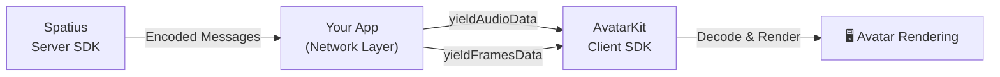

## What is Host Mode?

In Host Mode, **your application** manages the network connection to AvatarKit's server-side SDK. Your server sends encoded messages to your client, and the client SDK receives and **decodes them internally** for synchronized playback and rendering.

<Warning>
Host Mode **requires** AvatarKit's server-side SDK to generate the encoded messages. The data passed to `yieldAudioData()` and `yieldFramesData()` are encoded messages from the server SDK — not raw audio or animation data you create yourself.
</Warning>

## When to Use

- **Custom network layer** — you manage the connection between your client and AvatarKit's server SDK yourself
- **RTC integration** — messages are relayed through a real-time communication server such as LiveKit
- **Proxy architecture** — your backend acts as a relay between the client and Motion Server

## Requirements

| Requirement | Description |
|-------------|-------------|
| **App ID** | Obtained from [Spatius Studio](https://app.spatius.ai) |
| **Session Token** | **Not required** on the client side |
| **Spatius Server SDK** | Your backend must integrate with the Spatius Server SDK to generate messages |

## Basic Mode vs Host Mode

| Aspect | Basic Mode | Host Mode |
|--------|----------|-----------|
| **Network** | Client SDK connects to Motion Server directly | Your app relays messages from the Spatius Server SDK |
| **Message Decoding** | Handled internally | Handled internally (same) |
| **Session Token** | Required (client-side) | Not required (client-side) |
| **Spatius Server SDK** | Not needed | **Required** on your backend |
| **Key Methods** | `send()`, `start()`, `close()` | `yieldAudioData()`, `yieldFramesData()` |
| **Use Case** | Simplest integration | Custom networking / RTC relay |

## Key Concepts

### ConversationId Management

ConversationId links audio and animation messages for a single conversation session:

1. Call `yieldAudioData()` — returns a `conversationId`
2. Use that `conversationId` when calling `yieldFramesData()`
3. Messages with a **mismatched** conversationId will be **discarded**
4. Use `getCurrentConversationId()` to retrieve the current active session ID

<Warning>
**Important:** Always use the conversationId returned by `yieldAudioData()` when sending animation messages. Mismatched IDs cause messages to be silently dropped.
</Warning>

### Fallback Mechanism

If you provide empty animation data (empty array or undefined), the SDK automatically enters **audio-only mode** for that session. Once in audio-only mode, any subsequent animation data for that session is ignored — only audio continues playing.

## Get Started

<CardGroup cols={3}>
  <Card title="Web Demo" icon="globe" href="https://github.com/spatialwalk/avatar-kit-web-demo">
    GitHub demo repository
  </Card>
  <Card title="iOS Demo" icon="apple" href="https://github.com/spatialwalk/avatar-kit-ios-demo">
    GitHub demo repository
  </Card>
  <Card title="Android Demo" icon="android" href="https://github.com/spatialwalk/avatar-kit-android-demo">
    GitHub demo repository
  </Card>
</CardGroup>
