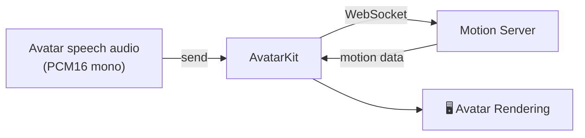

## What is Direct Mode Integration?

Direct Mode Integration maps to `DrivingServiceMode.sdk` in SDK code. AvatarKit on the client establishes a WebSocket connection to Motion Server, sends avatar speech audio, receives motion data, and renders the avatar locally.



## When to use

- **You already have avatar speech audio** — your own TTS, a TTS provider, or prerecorded audio.
- **Smallest backend footprint** — your backend only mints Session Tokens; ASR, LLM, and TTS run wherever you already host them.
- **Cross-platform** — Web, iOS, Android, and Flutter clients use the same Direct Mode model.

## What the token server does

Direct Mode has a small backend requirement because `SPATIUS_API_KEY` is a server-side secret. Your client asks your backend for a Session Token; your backend calls the Console API with the API Key; the client then uses that short-lived Session Token to open the Motion Server WebSocket.

This token server is not part of the avatar runtime. It does not send audio, receive motion data, run ASR / LLM / TTS, or proxy the Motion Server connection.

| Path | Backend responsibility | Client responsibility |
| --- | --- | --- |
| **Direct Mode** | Mint Session Tokens only. | Connect to Motion Server, send avatar speech audio, receive motion data, and render locally. |
| **Backend Mode** | Run the Server SDK pipeline, connect to Motion Server, and transport encoded audio + motion messages to clients. | Receive encoded messages from your backend and render locally. |

## Requirements

| Requirement | Description |
|-------------|-------------|
| **App ID** | Obtained from [Spatius Studio](https://app.spatius.ai). |
| **Session Token** | Issued from your backend (max 24 h validity). See [Credentials](/getting-started/credentials). |
| **Audio format** | PCM16, mono, configurable sample rate (default 16 kHz). See [Audio](/concepts/audio). |

<Note>
**Authentication flow:**

```
Your Client → Your token endpoint → Spatius Console API → Session Token (24 h max)
```

The Session Token must be set before `start()`. Keep `SPATIUS_API_KEY` in the token endpoint only; never ship it in Web, mobile, or Flutter client code. See the [Session token API](/api-reference/api-reference) for backend implementation.
</Note>

## Platform comparison

| Feature | Web | iOS | Android | Flutter |
|---------|-----|-----|---------|---------|
| **Package** | `@spatius/avatarkit` | `AvatarKit.xcframework` / SPM | `ai.spatius:avatarkit` | `spatius` |
| **Rendering** | WebGL / WebGPU | Metal | Vulkan | Native iOS / Android rendering through Flutter |
| **UI Framework** | DOM Canvas | UIKit + SwiftUI wrapper | Android View + Compose wrapper | Flutter widget |
| **Audio init** | `initializeAudioContext()` in user gesture | Automatic | Automatic | Automatic |
| **Build config** | Vite plugin / Next.js wrapper required | Xcode linker flags | Gradle dependency | Flutter pub package + platform build setup |

## Key concepts

### Fallback mechanism

If the WebSocket connection fails within 15 seconds, the SDK enters **audio-only fallback** — audio continues to play without animation. Your audio playback remains uninterrupted even when Motion Server is unreachable.

### ConversationId

Every `send()` call returns a `conversationId` that identifies the current conversation round. When `end: true` is passed, it marks the end of audio input. The avatar continues playing remaining animation until finished, then automatically returns to idle (notified via `onConversationState`). Sending new audio after that starts a new round and interrupts any ongoing playback.

For audio source and timing guidance, see [Audio](/concepts/audio).

## Next steps

Pick the platform you want to integrate on:

<CardGroup cols={2}>
  <Card title="Web" icon="globe" href="/direct-mode/web">
    Direct Mode integration for the browser with `@spatius/avatarkit`.
  </Card>
  <Card title="iOS" icon="apple" href="/direct-mode/ios">
    Direct Mode integration for iOS with `AvatarKit.xcframework`.
  </Card>
  <Card title="Android" icon="android" href="/direct-mode/android">
    Direct Mode integration for Android with `ai.spatius:avatarkit`.
  </Card>
  <Card title="Flutter" icon="mobile" href="/direct-mode/flutter">
    Direct Mode integration for Flutter with the `spatius` package.
  </Card>
</CardGroup>
