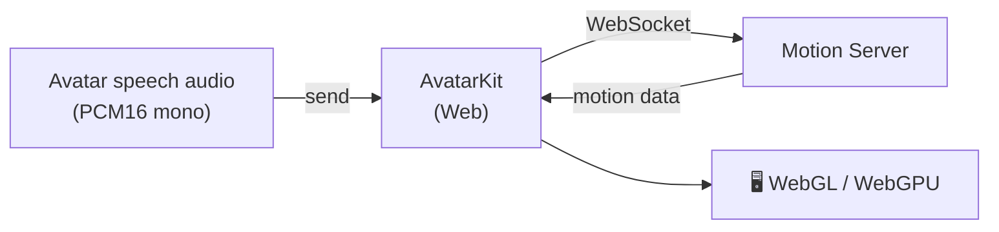

## What is Direct Mode for Web?

Direct Mode for Web is the simplest way to put a Spatius avatar in a browser app. `@spatius/avatarkit` connects directly to Motion Server, sends avatar speech audio, and renders motion locally — no agent worker or relay backend needed beyond a Session Token endpoint.



## When to use

- You have or generate avatar speech audio in the browser — your own TTS output, prerecorded clips, or agent audio fetched server-side.
- You want the smallest backend footprint: a single Session Token endpoint.
- You want the client to own rendering and don't need backend-controlled audio or transport.

## Run the demo

<CardGroup cols={2}>
  <Card title="Web SDK quickstart" icon="globe" href="/quickstarts/web-sdk">
    One quickstart with bundled sample audio plus optional realtime conversation.
  </Card>
  <Card title="Multi-framework reference" icon="github" href="https://github.com/spatius-ai/spatius-avatar-demo/tree/main/direct-mode/clients/web/reference">
    React, Vue, vanilla JavaScript, and Next.js reference clients.
  </Card>
</CardGroup>

## Install

<Tabs>
<Tab title="pnpm">

```bash
pnpm add @spatius/avatarkit
```

</Tab>
<Tab title="npm">

```bash
npm install @spatius/avatarkit
```

</Tab>
<Tab title="yarn">

```bash
yarn add @spatius/avatarkit
```

</Tab>
</Tabs>

## Build tool configuration

<Warning>
**Required:** The SDK uses WASM files that need special build configuration. Configure your build tool before initializing the SDK, or `.wasm` requests will fail.
</Warning>

<Tabs>
<Tab title="Vite">

Add the official plugin to `vite.config.ts`:

```typescript title="vite.config.ts"
import { defineConfig } from 'vite'
import { avatarkitVitePlugin } from '@spatius/avatarkit/vite'

export default defineConfig({
  plugins: [
    avatarkitVitePlugin(),
  ],
})
```

<Accordion title="What the plugin handles">

- **Dev server**: serves `.wasm` files with the correct MIME type
- **Build**: copies WASM files to `dist/assets/`
- **Cloudflare Pages**: generates a `_headers` file
- **Vite options**: configures `optimizeDeps`, `assetsInclude`, `assetsInlineLimit`

</Accordion>

<Accordion title="Manual Vite configuration (without the plugin)">

```typescript title="vite.config.ts"
import { defineConfig } from 'vite'

export default defineConfig({
  optimizeDeps: {
    exclude: ['@spatius/avatarkit'],
  },
  assetsInclude: ['**/*.wasm'],
  build: {
    assetsInlineLimit: 0,
    rollupOptions: {
      output: {
        assetFileNames: (assetInfo) => {
          if (assetInfo.name?.endsWith('.wasm')) {
            return 'assets/[name][extname]'
          }
          return 'assets/[name]-[hash][extname]'
        },
      },
    },
  },
  configureServer(server) {
    server.middlewares.use((req, res, next) => {
      if (req.url?.endsWith('.wasm')) {
        res.setHeader('Content-Type', 'application/wasm')
      }
      next()
    })
  },
})
```

</Accordion>

</Tab>
<Tab title="Next.js">

Wrap your config in `next.config.mjs`:

```javascript title="next.config.mjs"
import { withAvatarkit } from '@spatius/avatarkit/next'

export default withAvatarkit({
  // ...your existing Next.js config
})
```

<Accordion title="What the wrapper handles">

- **Asset paths**: patches Emscripten `scriptDirectory` to resolve from `/_next/static/chunks/`
- **WASM copy**: copies `.wasm` files into `static/chunks/` (client build only)
- **Response headers**: adds `application/wasm` for `/_next/static/chunks/*.wasm`
- **Config chaining**: preserves your existing `webpack` and `headers` configuration

</Accordion>

<Accordion title="Composing with other config wrappers">

```javascript title="next.config.mjs"
import { withAvatarkit } from '@spatius/avatarkit/next'
import withOtherPlugin from 'other-plugin'

export default withAvatarkit(withOtherPlugin({
  // ...your config
}))
```

</Accordion>

</Tab>
</Tabs>

For deeper toolchain explanation, see [Toolchain Setup](/sdk-reference/web-sdk/toolchain).

## Minimum integration

The smallest end-to-end flow with `@spatius/avatarkit`:

<Steps>
<Step title="Initialize the SDK">

```typescript
import { AvatarSDK, DrivingServiceMode } from '@spatius/avatarkit'

await AvatarSDK.initialize('your-app-id', {
  region: 'us-west',                             // optional, default: closest region
  drivingServiceMode: DrivingServiceMode.direct, // default
})

AvatarSDK.setSessionToken('your-session-token')
```

</Step>

<Step title="Load the avatar">

```typescript
import { AvatarManager } from '@spatius/avatarkit'

const avatar = await AvatarManager.shared.load('your-avatar-id', (progress) => {
  // progress.progress is in 0..1; multiply by 100 to render as a percentage.
  const percent = Math.round((progress.progress ?? 0) * 100)
  console.log(`Loading: ${percent}%`)
})
```

</Step>

<Step title="Mount the view">

```typescript
import { AvatarView } from '@spatius/avatarkit'

// Container must have non-zero width and height.
const container = document.getElementById('avatar-container')!
const avatarView = new AvatarView(avatar, container)
```

</Step>

<Step title="Initialize audio (inside a user gesture)">

<Warning>
`initializeAudioContext()` must be called inside a user-gesture handler (a `click`, `touchstart`, or similar listener). Browsers reject `AudioContext` creation outside user gestures and the call fails silently.
</Warning>

```typescript
button.addEventListener('click', async () => {
  await avatarView.controller.initializeAudioContext()
})
```

</Step>

<Step title="Connect and send audio">

```typescript
import { ConnectionState } from '@spatius/avatarkit'

await avatarView.controller.start()

await new Promise<void>((resolve, reject) => {
  avatarView.controller.onConnectionState = (state) => {
    if (state === ConnectionState.connected) resolve()
    else if (state === ConnectionState.failed) reject(new Error('Connection failed'))
  }
})

// Stream PCM16 mono audio at the configured sample rate (default 16 kHz)
avatarView.controller.send(audioChunk, /* end */ false)

// Mark end of the conversation round
avatarView.controller.send(lastChunk, /* end */ true)
```

For audio source and timing guidance, see [Audio](/concepts/audio).

</Step>

<Step title="Cleanup">

```typescript
avatarView.controller.close()
avatarView.dispose()
```

</Step>
</Steps>

For full API signatures, types, audio format details, lifecycle management, error codes, browser compatibility, and common issues, see [Web SDK Reference](/sdk-reference/web-sdk/reference).

## Next steps

<CardGroup cols={2}>
  <Card title="Web SDK reference" icon="code" href="/sdk-reference/web-sdk/reference">
    Complete Web SDK API: AvatarSDK, AvatarManager, AvatarView, AvatarController, types, errors.
  </Card>
  <Card title="Browse all demos" icon="github" href="/resources/demo-projects">
    Every runnable demo by platform and integration path.
  </Card>
</CardGroup>
